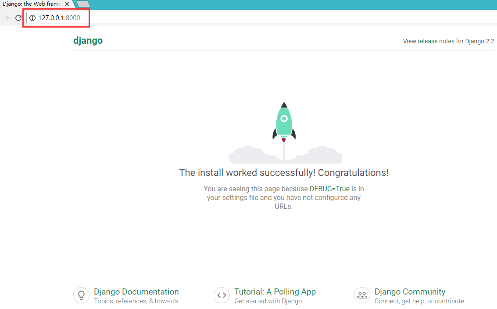
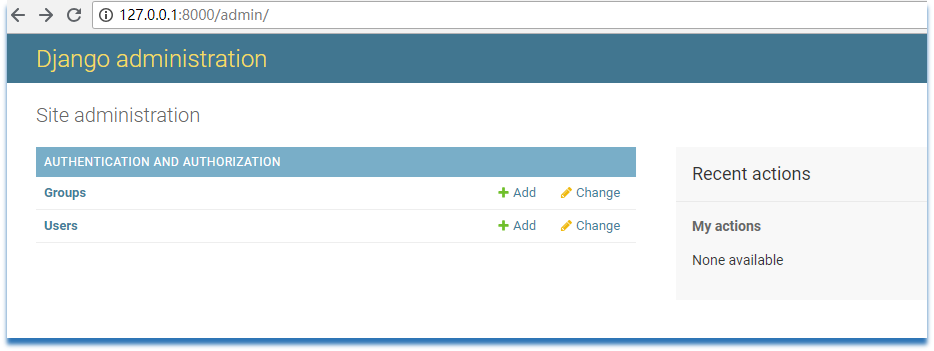
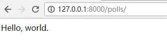
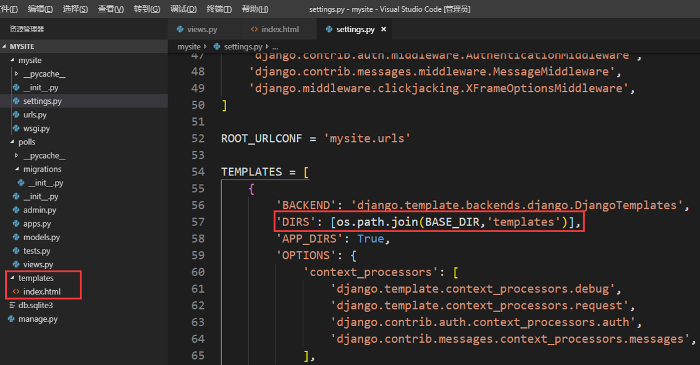
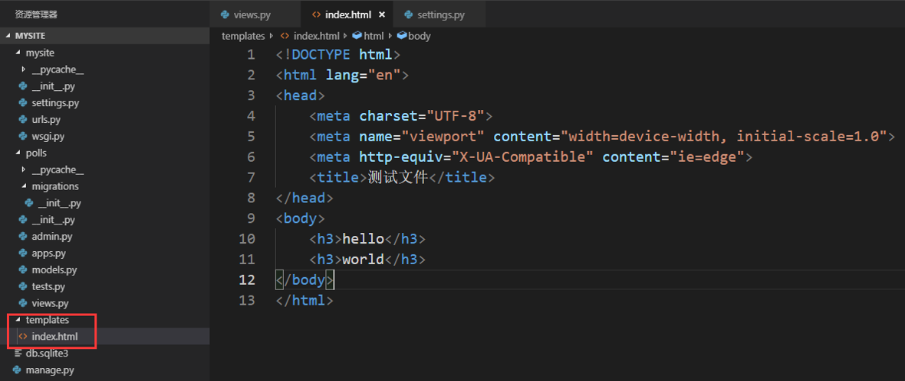
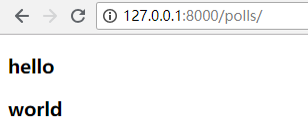
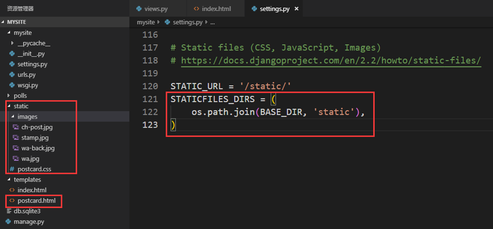
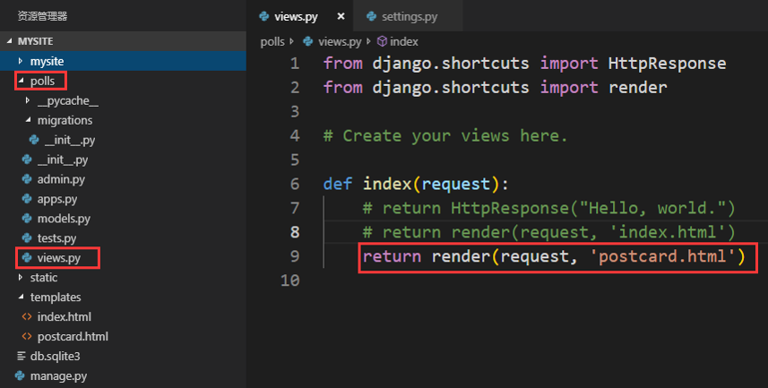
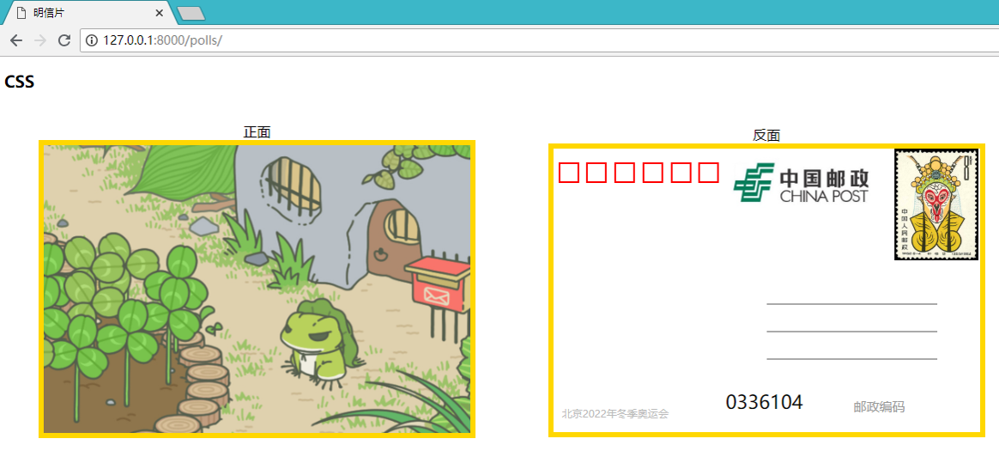
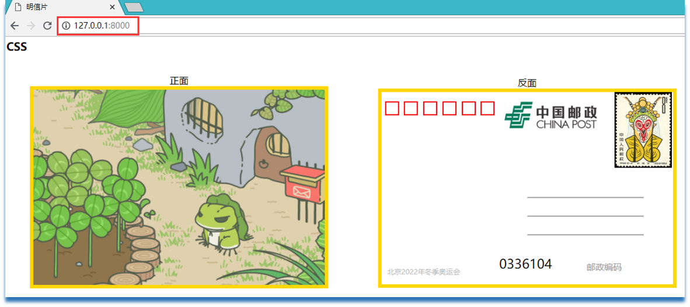

### 案例：Django显示静态网页 ###
[工程程序](Demo/static_html)

1. 环境配置

		推荐：pip install django

		python setup.py install

			未安装依赖包：
				asgiref-3.2.0
				pytz-2019.2
				sqlparse-0.3.0

2. 验证环境

		cmd中的操作
		
			输入py或python，回车
		
			>>> import django
			>>> django.get_version()
			'2.2'
3. 创建项目工程，显示默认页面

		cmd中的操作
		
			django-admin startproject [mysite]
			
			cd mysite
			
			python manage.py runserver

		谷歌浏览器的操作
		
			http://127.0.0.1:8000/

			效果：可以看到上升的火箭，如下图。

	

4. 创建管理员

		cmd中的操作
		
			python manage.py migrate
			python manage.py createsuperuser
			设置管理员的用户名和密码
			
			python manage.py runserver

		谷歌浏览器的操作
			
			http://127.0.0.1:8000/admin
			登录管理员的用户名和密码

			效果：能正常登录成功，并显示相关信息，如下图所示。

	

5. 创建APP应用

		cmd中的操作
		
			django-admin startapp [polls]
			
6. 配置APP应用，使其显示“Hello，World.”的文本信息

	**配置路由系统匹配规则**

		mysite>urls.py

			from django.contrib import admin
			from django.urls import path
			
			# 新增导入视图模块
			from polls import views
			
			urlpatterns = [
			    path('admin/', admin.site.urls),
				# 新增路由规则
			    path('polls/', views.index),
			]

	**配置视图函数**

		polls>views.py
		
			# 新增导入HttpResponse类
			from django.shortcuts import HttpResponse
			from django.shortcuts import render
			
			# Create your views here.
			# 新增视图函数
			def index(request):
			    return HttpResponse("Hello, world.")

	**运行服务器**

		cmd中的操作

			python manage.py runserver

	**客户端请求访问**

		谷歌浏览器的操作
		
			http://127.0.0.1:8000/polls/

			效果：可以看到文本内容显示到页面上，如下图。
	

7. 配置APP应用，使其显示仅html的静态文件

	**配置工程模板路径**

	mysite>settings.py

		TEMPLATES变量中，给DIRS键的值列表中添加os.path.join(BASE_DIR,'templates')，如下图所示：
	

	**创建模板文件**

		在polls应用同级目录下，创建templates目录，并在该目录下书写index.html文件，测试文件如下图所示：

	

	**配置路由系统匹配规则（CBV）**

		mysite>urls.py

			from django.contrib import admin
			from django.urls import path
			
			# 新增导入视图模块
			from polls import views
			
			urlpatterns = [
			    path('admin/', admin.site.urls),
				# 新增路由规则（CBV），as_view()为固定写法
				path('polls/', views.Home.as_view())
			]

	**配置视图函数**

		polls>views.py（FBV，function base views： 在视图里使用函数处理请求）
		
			from django.shortcuts import HttpResponse
			from django.shortcuts import render
			
			# Create your views here.
			
			def index(request):
			    # return HttpResponse("Hello, world.")
				# 新增语句
			    return render(request, 'index.html')

		polls>views.py（CBV，class base views： 在视图里使用类处理请求）

			from django.shortcuts import HttpResponse
			from django.shortcuts import render
			from django.views import View
			
			# Create your views here.
			
			# def index(request):
			    # return HttpResponse("Hello, world.")
			    # return render(request, 'index.html')
	
			
			class Home(View):
			    def get(self, request):
			        return render(request, 'index.html')

	**运行服务器**

		cmd中的操作

			python manage.py runserver

	**客户端请求访问**

		谷歌浏览器的操作
		
			http://127.0.0.1:8000/polls/

			效果：可以看到html文件内容显示到页面上，如下图。
	

8. 配置APP应用，使其显示带CSS的html的静态文件

	**配置静态文件路径**

	mysite>settings.py

		在文件最后添加配置信息，如下图所示：

	

	**配置静态文件**

	在polls应用同级目录下，创建static目录，并在static目录中放置CSS、图片等相关内容，如上图左侧所示。

	**配置视图函数**

		polls>views.py
		
			from django.shortcuts import HttpResponse
			from django.shortcuts import render
			
			# Create your views here.
			
			def index(request):
			    # return HttpResponse("Hello, world.")
				# 新增语句
			    # return render(request, 'index.html')
				return render(request, 'postcard.html')

	

	**postcard.html静态文件修改点**

		<link rel="stylesheet" href="/static/postcard.css">
		
		

	**运行服务器**

		cmd中的操作

			python manage.py runserver

	**客户端请求访问**

		谷歌浏览器的操作
		
			http://127.0.0.1:8000/polls/

			效果：可以看到postcard文件内容显示到页面上，如下图。

	

9. 设置默认显示页和路由名称

	**路由规则**

		mysite>urls.py
		
			from django.contrib import admin
			from django.urls import path
			
			from polls import views 
			
			urlpatterns = [
			    path('admin/', admin.site.urls),
			    # path('polls/', views.index),
			    # 设置首页
			    # path('', views.index),
			    # name路由对应名称
			    path('', views.index, name='index'),
			]

	**运行服务器**

		cmd中的操作

			python manage.py runserver

	**客户端请求访问**

		谷歌浏览器的操作
		
			http://127.0.0.1:8000/

			效果：可以看到postcard文件内容显示到默认页面上，如下图。

	

10. 请求生命周期

	用户发送请求-> 路由系统匹配规则（urls.py）-> 视图函数或类中的方法（app>views.py）-> DB + 模板（templates）+ 静态文件（static）-> 用户
	

11. 注册APP应用

		mysite>settings.py
			
			在INSTALLED_APPS变量的最后添加APP应用的内容
	
			INSTALLED_APPS = [
			    'django.contrib.admin',
			    'django.contrib.auth',
			    'django.contrib.contenttypes',
			    'django.contrib.sessions',
			    'django.contrib.messages',
			    'django.contrib.staticfiles',
			    'polls',
			]