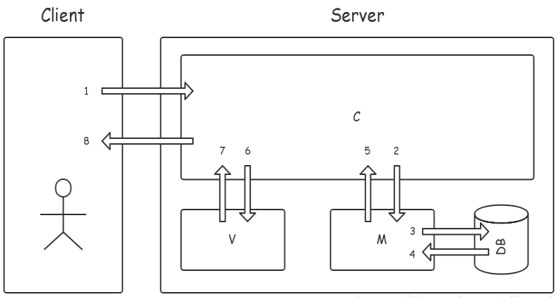
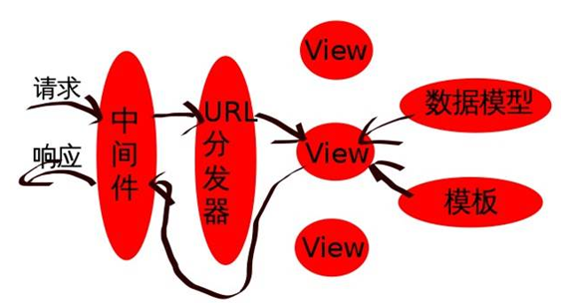
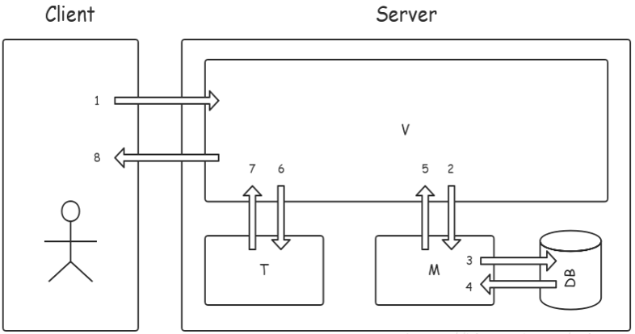

### Django简介 ###
- 学习基本知识
	- 需要了解一些基础的 Web 知识
	- Python 2.x 基础教程 或 Python 3.x 基础教程

Python下有许多款不同的 Web 框架。Django是重量级选手中最有代表性的一位。

Django是一个开放源代码的Web应用框架，由Python写成。

Django遵守BSD版权，初次发布于2005年7月, 并于2008年9月发布了第一个正式版本1.0 。

MVC百度百科：全名Model View Controller，是模型(model)－视图(view)－控制器(controller)的缩写，一种软件设计典范，用一种业务逻辑、数据、界面显示分离的方法组织代码，将业务逻辑聚集到一个部件里面，在改进和个性化定制界面及用户交互的同时，不需要重新编写业务逻辑。

通俗解释：一种文件的组织和管理形式，这其实就是把不同类型的文件放到不同的目录下的一种方法。前后端分离，松耦合等等。　　
　　　　　
	模型(model)：定义数据库相关的内容，一般放在models.py文件中。
	视图(view)：定义HTML等静态网页文件相关，也就是那些html、css、js等前端的东西。
	控制器(controller)：定义业务逻辑相关，就是你的主要代码。　　

MVC各部分的功能:

	M全拼为Model，主要封装对数据库层的访问，对数据库中的数据进行增、删、改、查操作。
	
	V全拼为View，用于封装结果，生成页面展示的html内容。
	
	C全拼为Controller，用于接收请求，处理业务逻辑，与Model和View交互，返回结果。

Django的MTV模式本质上和MVC是一样的，也是为了各组件间保持松耦合关系，只是定义上有些许不同。

Django的MTV模式分别是：

	M 代表模型（Model）：负责业务对象和数据库的关系映射(ORM)。
	T 代表模板 (Template)：负责如何把页面展示给用户(html)。
	V 代表视图（View）：负责业务逻辑，并在适当时候调用Model和Template。

	除了以上三层之外，还需要一个URL分发器，它的作用是将一个个URL的页面请求分发给不同的View处理，View再调用相应的Model和Template，MTV的响应模式如下所示：

MVT各部分的功能:

	M全拼为Model，与MVC中的M功能相同，负责和数据库交互，进行数据处理。
	
	V全拼为View，与MVC中的C功能相同，接收请求，进行业务处理，返回应答。
	
	T全拼为Template，与MVC中的V功能相同，负责封装构造要返回的html。
